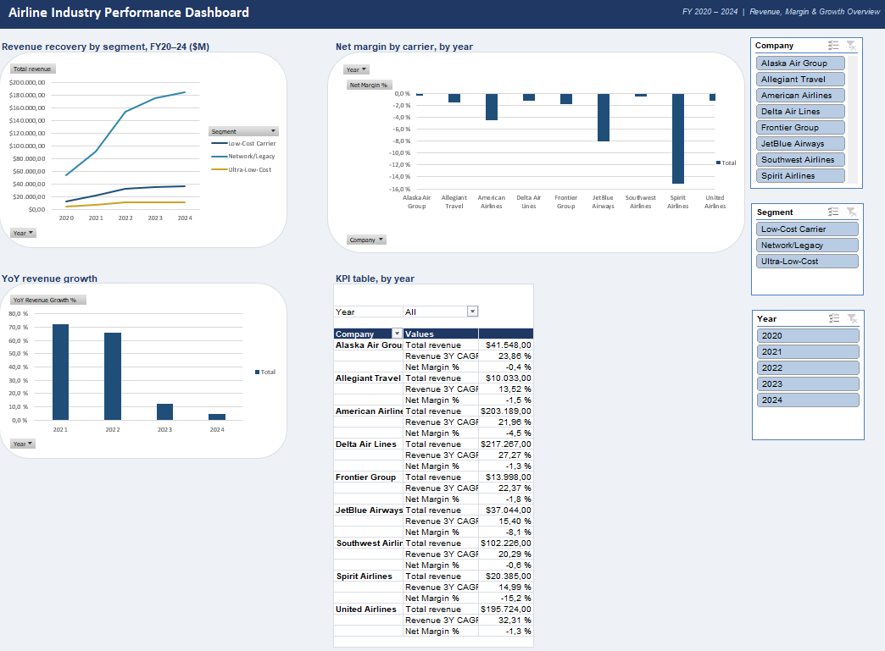

# Airline Industry Performance Dashboard

**Excel · Power Query · Power Pivot · DAX** 
An interactive analysis of nine US airlines across FY2020–2024, spanning the COVID-19 collapse in air travel and the multi-year recovery that followed.



## What it does

The workbook consolidates raw revenue and net-income data for nine publicly-listed US carriers, classifies each by business model (network/legacy, low-cost, ultra-low-cost), and surfaces the results on a single interactive dashboard. It's built to answer three questions:

- How fast did revenue recover after 2020?
- Which carriers returned to profitability, and when?
- How does performance differ across airline business models?

## Key findings

- **Revenue tripled off the 2020 low** — roughly $69bn to $233bn (+235%), with most of the recovery complete by FY2022.
- **Network/legacy carriers dominate** the sector (~78% of five-year revenue) and recovered profitability fastest.
# Airline Industry Performance Dashboard

**Excel · Power Query · Power Pivot · DAX** — an interactive analysis of nine US airlines across FY2020–2024, spanning the COVID-19 collapse in air travel and the multi-year recovery that followed.


## What it does

The workbook consolidates raw revenue and net-income data for nine publicly-listed US carriers, classifies each by business model (network/legacy, low-cost, ultra-low-cost), and surfaces the results on a single interactive dashboard. It's built to answer three questions:

- How fast did revenue recover after 2020?
- Which carriers returned to profitability, and when?
- How does performance differ across airline business models?

## Key findings

- **Revenue tripled off the 2020 low** — roughly $69bn to $233bn (+235%), with most of the recovery complete by FY2022.
- **Network/legacy carriers dominate** the sector (~78% of five-year revenue) and recovered profitability fastest.
- **Recovery ≠ profit.** Across the full 2020–2024 window every carrier shows a negative *cumulative* net margin, because the 2020 losses were so deep — but by FY2024, six of the nine were profitable again. The exceptions were JetBlue, Spirit and Allegiant.
- **Margins vary widely by segment:** the least-negative five-year net margins belong to Alaska and Southwest; the worst is Spirit (which entered Chapter 11 in late 2024).

## How it's built

```
RevenueRaw ─┐                          ┌─ Companies (segment, country)
            ├─ Power Query ─ long fmt ─┤
NetIncomeRaw┘  (unpivot + merge map)   └─ Years
                        │
                        ▼
              Power Pivot data model  (star schema)
                        │
                        ▼
              DAX measures  ──►  PivotCharts + slicers  ──►  Dashboard
```

1. **Power Query** — raw pulls arrive as wide, messy tables (mixed number formats, missing years, company-name vs. ticker keys). Queries trim and retype the data, **unpivot** the year columns into long format, and **merge** a name→ticker→segment mapping.
2. **Power Pivot** — the cleaned `Financials` fact table is modelled against `Companies` and `Years` dimensions in a star schema (one-to-many relationships on Ticker and Year).
3. **DAX** — measures for Total Revenue, Net Margin %, YoY Revenue Growth %, 3-Year CAGR, and Segment Net Margin (a peer benchmark built with `ALLEXCEPT`).
4. **Dashboard** — PivotCharts (revenue recovery by segment, net margin by carrier, YoY growth) plus a KPI table, all driven by **Segment / Company / Year slicers** connected across every visual.

## Workbook structure

| Sheet | Purpose |
|---|---|
| `Overview` | Project summary, at-a-glance KPIs, key insights |
| `Dashboard` | Interactive charts, KPI table, slicers |
| `RevenueRaw` / `RevenueLong` | Raw revenue pull → cleaned long-format query |
| `NetIncomeRaw` / `NetIncomeLong` | Raw net-income pull → cleaned long-format query |
| `NameLookup` | Company-name → ticker mapping |
| `CompanyMaster` | Ticker → company, segment, country dimension |

## Data & methodology

Figures are in US$ millions, sourced from **company 10-K/8-K filings and macrotrends.net** (retrieved June 2026). Where a headline figure was uncertain (smaller carriers, distressed years), it was cross-checked against the SEC filing — e.g. Spirit's FY2024 net loss and Allegiant's FY2024 result were taken directly from the 10-K rather than an aggregator. Two pre-IPO 2020 figures (Frontier, Allegiant) come from S-1 filings.

## How to use

Open in Excel (desktop, with Power Pivot enabled). Use the **Segment / Company / Year** slicers on the Dashboard to filter the whole page. To refresh after editing the raw sheets: **Data ▸ Refresh All**.

---
*Personal project. Not investment advice; figures should be verified against primary filings before any real-world use.*

